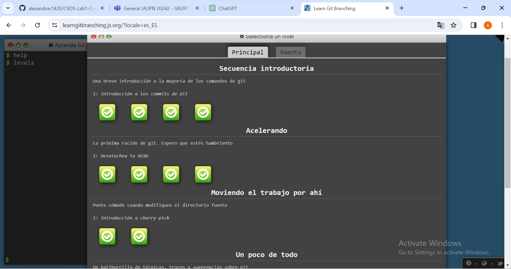
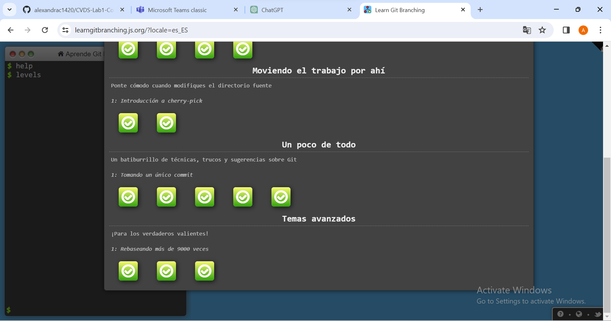

# Mi perfil

¡Hola! Soy Alexandra 

## Datos básicos
- **Nombre:** Alexandra Cortes Tovar
- **Correo Electrónico**: alexandra.cortes@mail.escuelaing.edu.co
- **Ubicación**: Bogotá, Colombia.

## Plan de Estudios
Actualmente estoy estudiando Ingeniería de Sistemas en la Universidad Escuela Colombiana de Ingeniería Julio Garavito.
   

### Proyectos Realizados
Algunos de los proyectos realizados son:
1. **Calculadora de operaciones cuanticas:** Permite realizar calculos cuanticos.
   - Tecnologías utilizadas: Python.
   - [Enlace al Proyecto](https://github.com/alexandrac1420/Teoria_Cuantica_Basica)

2. **Simulador de un computador cuántico:** Permite realizar diversas simulaciones de los sistemas cuanticos
   - Tecnologías utilizadas: Python.
   - [Enlace al Proyecto](https://github.com/alexandrac1420/Simulacion_Clasico_Cuantico)

En caso de que se desee utilizar algunos de estos proyectos es necesario que tenga en cuenta los siguientes parametros:
1. Representación 
 
    El programa reconoce de entrada de numero complejo una parte real y una imaginaria representadas en tuplas. Por ejemplo, si quiero realizar alguna operación con el numero 5 + 2i, este se ingresará al programa de la siguiente manera complex(5,2).
    Para ingresar un vector de números complejos se debe seguir la siguiente estructura __vector = [complex(numero1), complex(numero2)]__

    Para ingresar una matriz de números complejos se debe ingresar las filas en el formato de los vectores __matriz = [[complex(numero1), complex(numero2)], [complex(numero3), complex(numero4)]]__, siendo la primera fila  _[complex(numero1), complex(numero2)]_ y la segunda  _[complex(numero3), complex(numero4)]_

2. Sintaxis operaciones 

    A continuación se presenta la sintaxis correcta para el uso de las operaciones disponibles:
    * __Simulador del experimento de las canicas booleanas__:simulaCanicas (_matriz de comportamiento, vector del estado inicial, numero de clicks_)
    * __Simulador del experimento múltiples rendijas clásico probabilístico, con más de dos rendijas.__:simul_multi_slit (_matriz de comportamiento, numero de clicks_)
    * __Simulador del experimento de las múltiples rendijas cuántico__:simul_multi_slit_imag (_matriz de comportamiento, numero de clicks_)

    Tenga en cuenta que es necesario utilizar la representacion de los numeros mencionada anteriormente.

3. Ejemplo de uso 
    ~~~python
    import numpy as np
    import ClasicoCuantico as lb

    #Ejemplo de uso del simulador de un sistema deterministico

    # Ingrese la matriz del comportamiento del sistema, junto con el vector de valores iniciales
    # y el numero de clicks en el que desea ver el estado
    m1 = np.array([[1,0,0],[0,1,0],[0,0,1]])
    v1 = [2,3,5]
    clicks = 3

    #Realice la simulación
    resultado_deterministico = lb.simulaCanicas(m1,v1,clicks)
    print(resultado_deterministico)

    # Ejemplo del simulador de un sistema probabilistico

    # Ingrese la matriz del comportamiento del sistema en numeros reales
    m2= np.array([[0,0,0,0,0,0,0],[1/3,0,0,0,0,0,0],[1/3,0,0,0,0,0,0],[1/3,0,0,0,0,0,0],[0,1/2,0,0,1,0,0],[0,1/2,1/2,0,0,1,0],[0,0,1/2,0,0,0,1]])
    clicks = 2

    #Realice la simulación
    # Por defecto se genera un diagrama de barras con las probabilidades del vector resultante
    resultado_probabilistico = lb.simul_multi_slit(m2, clicks)
    print(resultado_probabilistico)

    # Ejemplo del simulador de un sistema cuantico

    # Ingrese la matriz del comportamiento del sistema en numeros imaginarios
    m3= np.array([[1/2,1,0],[complex(0,-1/2),complex(0,1/2),0],[0,0,complex(0,1)]])
    clicks = 2

    #Realice la simulación
    # Por defecto se genera un diagrama de barras con las probabilidades del vector resultante
    resultado_cuantico = lb.simul_multi_slit_imag(m3, clicks)
    print(resultado_cuantico)

    ~~~

# Parte 3 -Git Branching

  
## Autor 
__Alexandra Cortes Tovar__ 
