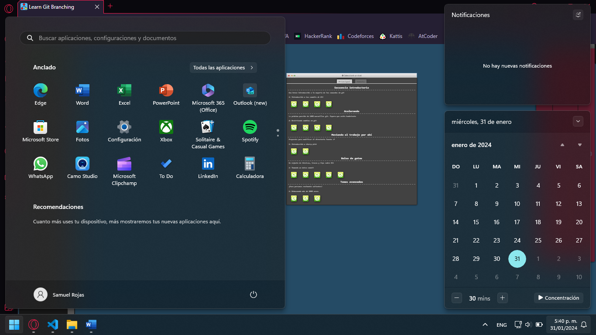
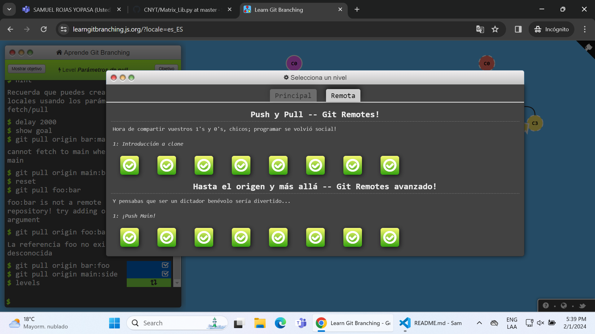

# Mi perfil

## Datos personales

**Nombre**: Samuel Rojas Yopasa

**Edad**: 20 años

**Fecha de nacimiento**: 23 de Septiembre de 2003

**Lugar de nacimiento**: Bogotá D.C.

## Perfil

Soy estudiante de Ingeniería de Sistemas de la Universidad Escuela Colombiana de Ingeniería Julio Garavito.

Actualmente estoy cursando séptimo semestre y estoy viendo las siguientes materias:

- Automatización de Procesos de Negocio _AUPN_
- Ciclos de Vida de Software _CVDS_
- Fundamentos Contables y Financieros _FCFI_
- Grandes Problemas de la Historia _GRAP_
- Redes de Computadores _RECO_

Un ejemplo del código que he realizado durante mi carrera es:

```
    # Transpuesta de una matriz cuadrada o vector
def Transposed(element):
    if type(element[0][0]) == tuple:
        result = [[[0] for _ in range(len(element))] for _ in range(len(element[0]))]
        for i in range(len(element)):
            for j in range(len(element[0])):
                result[j][i] = element[i][j]
        result = To_Tuple(result)
    else:
        result = [[0] for _ in range(len(element))]
        for i in range(len(element)):
            result[i][0] = element[i]
        result = To_Tuple(result)
    return tuple(result)
```

# Cosas sobre mí

Me gusta mucho jugar a videojuegos y algunos de mis favoritos son:

1. Hollow Knight
2. Celeste
3. Undertale
4. Blasphemous
5. Neon White

Y muchos otros más, pero estos son algunos de mis favoritos.

Adjunto también las imágenes del ejercicio de Git Branching y los repositorios remotos.

### Git Branching



### Git Remote
